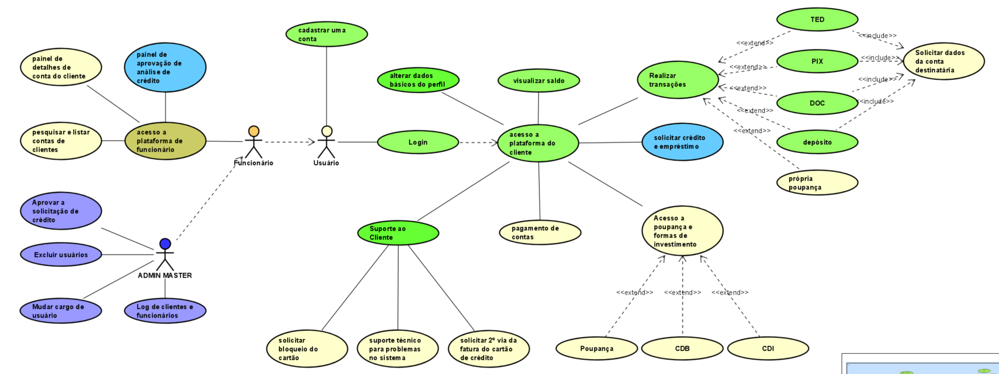




## 👁️‍🗨️ Visão geral

Sistema _fintech_ feito de forma colaborativa pelos alunos da Estácio para fins de aprendizado e experiência em como elaborar um produto e executar um projeto.
O Cyber Bank tem por objetivo, simular as atividades de um banco real. Desde a criação do seu primeiro colaborador(atividade realizada pela empresa), quanto a interface de abertura de conta e procedimentos de um banco, tipos de contas, movimentações e muito mais.
Este repositório único abrigará todos os projetos concebidos para a viabilização do produto. Será construido de forma gradual, um aperfeiçoamento de cada vez, para não só a simulação da criação de um serviço, mas para que todos os envolvimentos aprendam desde os levantamentos de requisitos, UML, gestão do projeto, estrutura do projeto, organização, linguagem de programação, desenvolvimento de software e muito mais!

## 🏗️ Módulos/Projetos

Um monolito, organizado nesse único repositório:

* web/
  * cyberbank/ (React)
* service/
  * cyberbank/ (Django)
* tests/
* docs/
  * regras de negócio, voltada aos alunos.

## 📋 Pré-requisitos

- node / npm
- python >= 3.11 / pip
- windowns / linux / macOS

## 🔧 Instalação

### Back-end

Pode ser usado o arquivo 'requirements.txt', dentro do diretório 'service', executando no diretório:

```bash
  > pip install -r requirements.txt
```

Ou, de forma manual:

```bash
  >
```

### Front-end

```bash
  >
```

## ⚙️ Executando testes

```bash
  > pytest
```

## 📦 Implantação

- Mais detalhes sobre a implantação, não citados nos códigos

## 👨‍💻 Técnicas e Tecnologias

- Vscode
- Pycharm
- Scrum(aplicação parcial)

## 📌 Versão

Dado um número de versão, de acordo com [semver](https://semver.org/lang/pt-BR/#spec-item-12):

1.1.0(**Futuro**): Seguir padrão, atualizações sempre acima;
1.0.0(**Em progresso**): Detalhes;

## ✒️ Autores

### Donos

| [<br><sub>Lucas Figueiredo</sub>](https://github.com/LucasFigueiredoDEV) | [<br><sub>Rafael Blauwer</sub>](https://github.com/Blauwer) |
| --- | --- |

### Requisitos

| [<br><sub>Berg</sub>](https://github.com/wlidemberg) | [<br><sub>Juan Novais</sub>](https://github.com/jnovais1) | [<br><sub>Jhonatan Sousa</sub>](https://github.com/Jhonatansousa/) |
| --- | --- | --- |

### Gestão do projeto

| [<br><sub>Naiara Cristi</sub>](https://github.com/Naiaracristi) | [<br><sub>Leidilena Leal</sub>](https://github.com/LEIDILENA) | [<br><sub>Miguel Tenório</sub>](https://github.com/MiguelHCJS) | [<br><sub>Juan Novais</sub>](https://github.com/jnovais1) |
| --- | --- | --- | --- |

### UX/UI

|[<br><sub>Carlos Eduardo</sub>](https://github.com/dossantoscarlos) | [<br><sub>Juan Souza</sub>](https://github.com/kyobeta/) |
| --- | --- |

### Front-end

|[<br><sub>Jhonatan Sousa</sub>](https://github.com/Jhonatansousa/) |
| --- |

### Back-end

| [<br><sub>Leonardo Silveira</sub>](https://github.com/sombriks) | [<br><sub>Miguel Tenório</sub>](https://github.com/MiguelHCJS) | [<br><sub>Carlos Eduardo</sub>](https://github.com/dossantoscarlos) |
|---|---|---|

### ADMs

| [<br><sub>Rafael Blauwer</sub>](https://github.com/Blauwer) | [<br><sub>Lucas Figueiredo</sub>](https://github.com/LucasFigueiredoDEV) | [<br><sub>Leidilena Leal</sub>](https://github.com/LEIDILENA) | [<br><sub>Miguel Tenório</sub>](https://github.com/MiguelHCJS) |
|---|---|---|---|
| [<br><sub>Juan Souza</sub>](https://github.com/kyobeta/) | [<br><sub>Jhonatan Sousa</sub>](https://github.com/Jhonatansousa/) | [<br><sub>Berg</sub>](https://github.com/wlidemberg) |

## 📄 licença

Mais detalhes sobre a licença, [clique aqui](https://github.com/estacio-alunos/cyber-bank/blob/main/LICENSE).

## 🎁 Agradecimentos

- Obrigado a todos, por enquanto.

## 📂 Docs

Versão não finalizada do diagrama de caso de uso para usuários:


